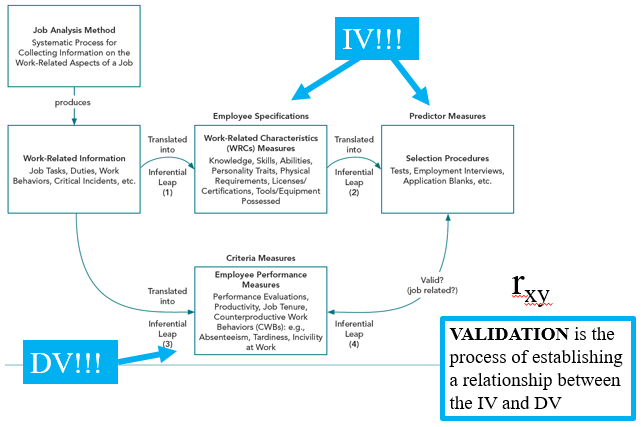

# Duties {#duties}

## Eagle I.O Expectations (Tasks aka Criteria aka DVs)
+ Coordinate and attend Fall semester orientation session in Late August
+ Attend mandatory bi-weekly meetings 
+ Contribute to Eagle I.O projects (mentorship program, survey developments)
+ Attend Eagle I-O events (METRO, social meetings, mentor meetings) 
+ Be a professional ambassador (aligned with: 1) Eagle, 2) MSU, and 3) the larger discipline of I-O Psychology)
+ Participte in completion of Eagle IO projects
+ Update Handbooks to support growth of program for future cohorts
+ Must participate as a mentor in the Mentorship program

## Eagle I.O Requirements (KSA’s aka Predictors aka IVs)
+ Ability to work in a team-based environment 
+ Be receptive to group members opinions and suggestions
+ Collaborate with group members to facilitate growth in current and future projects

 

